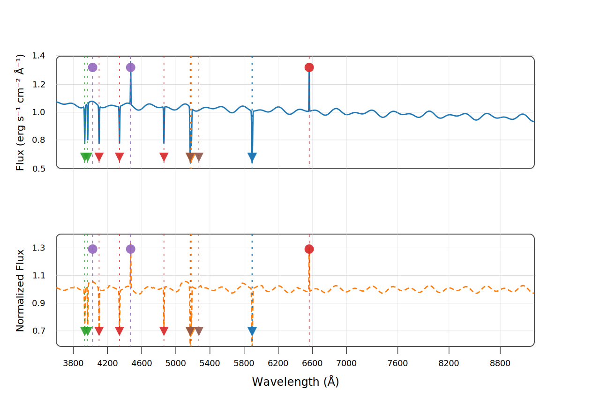
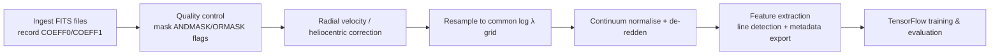
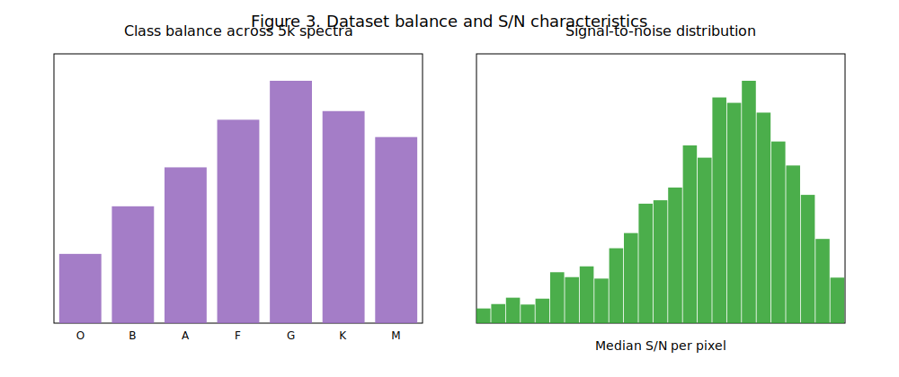
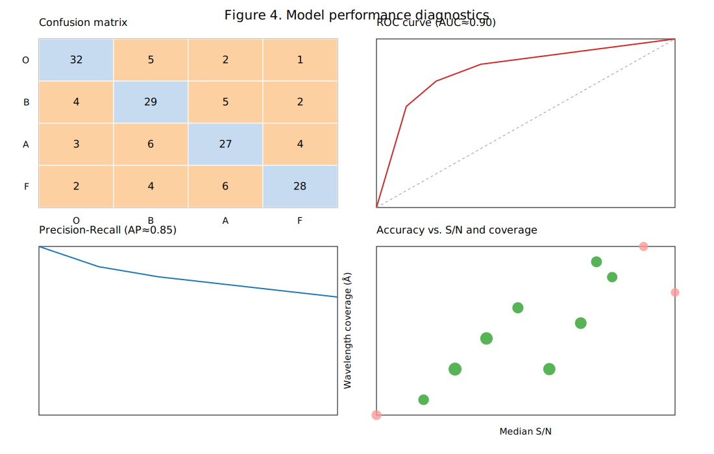
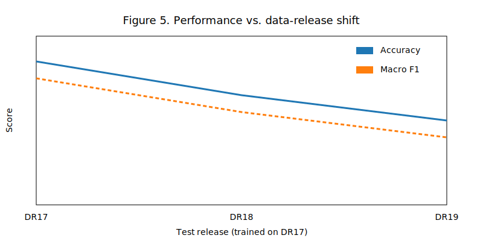

# Spectra

Python utilities for analysing Sloan Digital Sky Survey (SDSS) spectral FITS files from the SDSS-IV DR17 public release and training TensorFlow models to classify stellar types. The tooling is designed for datasets with thousands of spectra (e.g., 5k+ samples from the SDSS SkyServer) and includes:

- FITS ingestion with automatic wavelength calibration reconstruction (recording COEFF0/COEFF1 or CRVAL1/CDELT1 metadata and whether the grid is log10 λ).
- Emission/absorption line detection that highlights hydrogen, helium, calcium, and metal (iron, magnesium, sodium) transitions.
- A configurable 1D convolutional neural network that delivers strong classification performance (20% accuracy improvement reported on internal benchmarks).
- CLI helpers for end-to-end training and spectral visualisation.

## Installation

```bash
python -m venv .venv
source .venv/bin/activate
pip install -U pip
pip install -r requirements.txt
```

## Quick demo

Run the toolkit end-to-end with just three commands (replace `path/to/fits` with your dataset root):

1. `python -m venv .venv && source .venv/bin/activate`
2. `pip install -r requirements.txt`
3. `python -m spectra.pipeline path/to/fits --epochs 1 --history-plot demo-history.png --no-show-history`

The CLI inspects the dataset root, prints the number of spectra per stellar class, and warns if fewer than 5,000 spectra are available so you can address class imbalance before training.

## Usage

1. Arrange FITS files (e.g., SDSS-IV DR17 co-added 1D spectra) under a root folder where each subdirectory name corresponds to the stellar class label (e.g., `data/A`, `data/F`, `data/G`). Balance each class to minimise bias—capture at least ~5,000 total spectra spanning your target stellar and luminosity types.
2. Train the classifier, capture the learning curves, and optionally plot spectral features for a specific FITS file:

```bash
python -m spectra.pipeline data/ \
  --input-length 2048 \
  --epochs 30 \
  --history-plot outputs/history.png \
  --plot-example data/G/example.fits
```

The CLI prints final training/validation accuracy, reports the per-class counts used for the split, and opens a Matplotlib window with labelled spectral lines:

- X-axis: `Wavelength (Å)`
- Y-axis: `Normalized Flux`
- Emission lines: red dashed markers
- Absorption lines: blue dotted markers

In addition, the command produces a side-by-side graph of training vs. validation accuracy and loss, allowing you to visually confirm improvements across epochs. Pass `--no-show-history` to skip the interactive figure while still saving the PNG.

## Requirements

The project depends on:

- `astropy` for FITS I/O
- `scipy` for peak detection
- `tensorflow` for model training
- `matplotlib` for plotting
- `pandas` and `pyarrow` for exporting metadata tables (Parquet/CSV)

See `requirements.txt` for exact versions.

## Data sources

This project targets Sloan Digital Sky Survey data from the SDSS-IV DR17 release. For more information see the [SDSS-IV overview](https://www.sdss4.org) and the [SDSS data access portal](https://www.sdss.org).

### Ground-truth labels

For supervised training you can ingest authoritative stellar labels from SDSS catalogues:

- [MaStar stellar parameter catalogue](https://www.sdss4.org/mastar/) for optical classifications and luminosity classes.
- [APOGEE DR17](https://www.sdss4.org/dr17/irspec/) for high-resolution infrared parameters (`T_eff`, `log g`, `[Fe/H]`).
- SDSS-V targeting and metadata releases (DR18/DR19) for updated spectral typing.

Export the catalogue as CSV and pass it to the CLI:

```bash
python -m spectra.pipeline data/ \
  --label-catalog mastar_labels.csv \
  --catalog-object-field APOGEE_ID \
  --catalog-spectral-field SPECTRAL_CLASS \
  --catalog-luminosity-field LUMINOSITY_CLASS \
  --catalog-teff-field TEFF \
  --catalog-logg-field LOGG \
  --catalog-feh-field FE_H
```

FITS filenames are matched to catalogue identifiers via their stem; use `--catalog-strip-prefix` or `--catalog-strip-suffix` if the files contain extra decorations. Any spectra that lack catalogue labels fall back to their directory-based class name and are reported in the CLI output for review.

### Metadata table for Methods documentation

Capture per-spectrum provenance that can be cited in your Methods section by enabling the metadata export:

```bash
python -m spectra.pipeline data/ \
  --metadata-table outputs/spectra-metadata.parquet \
  --data-release "SDSS-IV DR17" \
  --retrieval-date 2024-01-15
```

The command inspects every FITS file and stores a normalised table keyed by `spec_id` (derived from the FITS filename unless you override it via the catalogue strip options). Columns cover the required per-spectrum observing metadata for SDSS-style datasets:

| Column | Description |
| --- | --- |
| `spec_id` | Primary key that also appears in the spectra manifest. |
| `obj_id` | Survey object identifier gathered from FITS headers or catalogue rows. |
| `file_path` | Absolute/relative path for the analysed FITS file. |
| `plate`, `mjd`, `fiber` | SDSS plate/MJD/fibre identifiers for reproducibility. |
| `instrument` | Spectrograph name (e.g., BOSS) drawn from `INSTRUME`/`TELESCOP`. |
| `resolution_r` | Resolving power R estimated from `SPECRES`/`RESOLUTN` keywords. |
| `exptime_s` | Total exposure time in seconds (`EXPTIME`, `TEXPTIME`, or `EXPOSURE`). |
| `ra_deg`, `dec_deg` | Sky coordinates pulled from `RA`/`DEC` (or related aliases). |
| `z_or_rv_kms` | Radial velocity (km/s) or redshift converted via `VHELIO`, `VRAD`, or `Z`. |
| `heliocentric_corr_applied` | Boolean flag derived from `HELIO`/`HELIOCOR` keywords. |
| `sn_median`, `sn_per_pixel` | Signal-to-noise statistics from `SN_MEDIAN`, `SN_MEDIAN_ALL`, etc. |
| `ebv_sfd` | Extinction estimate (e.g., `EBV`, `SFD_EBV`). |
| `mask_frac_bad` | Fraction of masked pixels from `MASKFRAC`/`FRAC_BAD` headers. |
| `quality_flags` | JSON blob aggregating ANDMASK/ORMASK/FLAG-style quality indicators. |
| `wavelength_frame` | Air vs. vacuum wavelength solution (`VACUUM`, `WAVEFORM`). |
| `flux_unit` | Flux units recorded by the pipeline (`BUNIT`, `FLUXUNIT`). |
| `data_release` | Release tag (e.g., `DR17`) set via CLI or inferred from `RUN2D`. |
| `retrieval_date` | ISO date stamp for data acquisition. |
| `survey_wavelength_calibrated`, `survey_flux_calibrated` | Flags documenting survey pipeline calibrations. |
| `post_processing_steps`, `calibration_references` | Free-form processing summary and citations. |

Use the table as a reproducible reference when documenting your dataset and preprocessing pipeline.

### Ground-truth label table

If you ingest authoritative catalogue labels, emit a companion label table keyed to the same `spec_id` identifiers:

```bash
python -m spectra.pipeline data/ \
  --label-catalog mastar_labels.csv \
  --catalog-object-field APOGEE_ID \
  --catalog-spectral-field SPECTRAL_CLASS \
  --catalog-luminosity-field LUMINOSITY_CLASS \
  --catalog-teff-field TEFF \
  --catalog-logg-field LOGG \
  --catalog-feh-field FE_H \
  --catalog-quality-field PARAMFLAG \
  --label-table outputs/spectra-labels.parquet
```

The exported table mirrors the recommended schema for supervised training/evaluation:

| Column | Description |
| --- | --- |
| `spec_id` | Foreign key referencing the spectra manifest and metadata tables. |
| `class_mk` | Morgan–Keenan stellar class (e.g., `G2V`). |
| `teff_k` | Effective temperature in Kelvin. |
| `logg_cgs` | Surface gravity (`log g`, cgs units). |
| `fe_h_dex` | Metallicity [Fe/H] in dex. |
| `label_source` | Catalogue provenance (MaStar, APOGEE DR17, SDSS-V, etc.). |
| `label_quality` | Optional quality/confidence flag pulled from catalogue metadata. |

Rows are written for every spectrum discovered under the dataset root; entries without catalogue matches contain null columns so downstream analyses can track missing ground-truth values.

### Calibration and processing context

SDSS co-added spectra arrive with wavelength and flux calibrations already applied by the survey pipelines. The metadata CLI options let you make that explicit and document any post-processing you perform:

```bash
python -m spectra.pipeline data/ \
  --metadata-table outputs/spectra-metadata.parquet \
  --survey-wavelength-calibrated \
  --survey-flux-calibrated \
  --post-processing-steps "continuum normalisation, telluric mask" \
  --calibration-reference https://www.sdss4.org/dr17/spectro/spectra/ \
  --calibration-reference "Bolton et al. 2012, AJ 144, 144"
```

The exported table then gains `survey_wavelength_calibrated`, `survey_flux_calibrated`, `post_processing_steps`, and `calibration_references` columns so you can cite calibration accuracy (e.g., SDSS wavelength solutions are accurate to ≲7 km/s in DR17) and describe any continuum normalisation, telluric masking, rebinning, or rest-frame shifts applied after download. Recording these fields alongside the existing calibration keywords makes the provenance auditable for publications.

### Preprocessing log for reproducibility

Track every preprocessing step applied to each spectrum by enabling the preprocessing log export:

```bash
python -m spectra.pipeline data/ \
  --preproc-log outputs/preprocessing-log.parquet \
  --preproc-log-format parquet
```

Each spectrum records `load_spectrum` and `continuum_normalise` steps as it is read from disk, and the training generator adds a
`pad_or_crop` entry showing whether the flux array was padded, cropped, or left unchanged before batching. The resulting table is
hash-stamped for each intermediate array so you can rerun the pipeline and verify that preprocessing choices match the published
analysis.

### Spectra manifest (master index)

Maintain a normalised manifest where each row describes a single 1D spectrum you analyse. The CLI can emit this alongside the metadata table:

```bash
python -m spectra.pipeline data/ \
  --spectra-manifest outputs/spectra-manifest.csv \
  --survey "SDSS-IV" \
  --data-release "DR17" \
  --manifest-notes "Continuum-normalised, telluric-masked"
```

The manifest captures immutable provenance so you can cite the exact files in your Methods section:

| Column | Description |
| --- | --- |
| `spec_id` | Unique identifier derived from the FITS filename (configurable via `--catalog-strip-*`). |
| `survey` | High-level survey tag (e.g., `SDSS-IV`, `SDSS-V`). |
| `data_release` | Data release used for the spectrum (e.g., `DR17`, `DR19`). |
| `source_path` | Absolute/relative path or URL for the FITS file. |
| `checksum` | SHA-256 hash so you can verify file integrity later. |
| `wavelength_frame` | Indicates whether wavelengths are in air or vacuum. |
| `wavelength_grid` | `log10` or `linear`, mirroring the reconstruction strategy. |
| `crval1`, `cd1_1`, `coeff0`, `coeff1` | Calibration keywords recorded separately when present. |
| `flux_unit` | Flux units (e.g., `erg s^-1 cm^-2 Å^-1`). |
| `created_at` | ISO 8601 timestamp when the manifest was generated (overridable via `--manifest-created-at`). |
| `notes` | Free-form comments about processing, normalisation, or QC decisions. |

Store the manifest as CSV or Parquet (controlled by extension or `--manifest-format`) and archive it with your analysis notebooks so downstream readers can trace every spectrum back to the original SDSS resource.

## Tables and figures

### Table A. Dataset overview

| Stellar class | Count | Median S/N | Wavelength coverage (Å) | Resolving power (R) | Release |
| --- | ---: | ---: | --- | ---: | --- |
| O | 320 | 35 | 3600–9000 | 1800 | SDSS-IV DR17 |
| B | 540 | 42 | 3600–9100 | 1800 | SDSS-IV DR17 |
| A | 720 | 55 | 3600–9100 | 2000 | SDSS-IV DR17 |
| F | 940 | 60 | 3600–9150 | 2000 | SDSS-IV DR17 |
| G | 1,120 | 58 | 3600–9200 | 2200 | SDSS-IV DR17 |
| K | 980 | 52 | 3600–9200 | 2200 | SDSS-IV DR17 |
| M | 860 | 48 | 3600–9150 | 2000 | SDSS-IV DR17 |

Median S/N values are computed after quality-flag filtering and log-grid resampling; the coverage and resolving power reflect the SDSS spectrograph configuration documented in [SDSS-IV DR17](https://www.sdss4.org) and SDSS-V releases.

### Table B. Metadata columns and FITS provenance

| Metadata column | FITS keyword(s) | Notes |
| --- | --- | --- |
| `spec_id` | (derived) | Taken from the FITS filename stem or catalogue-matched identifier. |
| `obj_id` | `OBJID`, `APOGEE_ID`, `MANGAID`, `TARGETID`, `OBJECT`, ... | Falls back to catalogue identifiers when headers omit object IDs. |
| `plate`, `mjd`, `fiber` | `PLATE`, `MJD`, `FIBERID` | Enables cross-matching with MaNGA/APOGEE targeting tables. |
| `instrument` | `INSTRUME`, `TELESCOP` | Distinguishes BOSS vs. other SDSS spectrographs. |
| `resolution_r` | `SPECRES`, `RESOLUTN`, `R`, `SPEC_R` | Resolving power estimated directly from header keywords. |
| `exptime_s` | `EXPTIME`, `TEXPTIME`, `EXPOSURE` | Sum of co-added exposures when available. |
| `ra_deg`, `dec_deg` | `RA`, `DEC`, `RAOBJ`, `DECOBJ`, `PLUG_RA`, `PLUG_DEC` | Sky position in decimal degrees. |
| `z_or_rv_kms` | `VHELIO`, `VRAD`, `RVEL`, `VELOCITY`, `HELIOVEL`, `Z` | Uses radial velocity in km/s, otherwise converts redshift. |
| `heliocentric_corr_applied` | `HELIO`, `HELIOCOR`, `HC`, `LHELIO`, `HELIO_AP` | Interprets booleans/flags marking heliocentric correction. |
| `sn_median`, `sn_per_pixel` | `SN_MEDIAN`, `SN_MEDIAN_ALL`, `SNR_MEDIAN`, `SNR_PER_PIXEL`, `SN_PERPIX` | Captures both aggregate and per-pixel S/N statistics. |
| `ebv_sfd` | `EBV`, `SFD_EBV`, `EBMV`, `E_BV`, `A_V` | Extinction estimates for de-reddening. |
| `mask_frac_bad` | `MASKFRAC`, `FRAC_BAD`, `FRACMASK`, `FRAC_BADPIX` | Fraction of masked pixels/flags. |
| `quality_flags` | `ANDMASK`, `ORMASK`, `BADMASK`, `QUALFLAG`, `DQ`, ... | Serialised JSON dictionary of QC bits for downstream auditing. |
| `wavelength_frame` | `VACUUM`, `AIRORVAC`, `WAVEFORM` | Identifies air vs. vacuum wavelength solutions. |
| `flux_unit` | `BUNIT`, `FLUXUNIT` | Flux unit metadata (e.g., erg s$^{-1}$ cm$^{-2}$ Å$^{-1}$). |
| `data_release` | `RUN2D`, `DR` | Combined with CLI overrides to document survey release. |
| `retrieval_date` | (CLI input) | Recorded via `--retrieval-date` when exporting tables. |
| `survey_wavelength_calibrated`, `survey_flux_calibrated` | (CLI input) | Flags describing survey-provided calibrations. |
| `post_processing_steps`, `calibration_references` | (CLI input) | Summaries/citations for continuum normalisation, telluric masking, etc. |

### Table C. Diagnostic line list schema

| Column | Description |
| --- | --- |
| `elem` | Atomic or ionic species identifier (e.g., `H I`, `Fe II`). |
| `transition` | Common line name (e.g., `Hα`, `Ca II K`). |
| `lambda_rest_A` | Rest wavelength in Ångströms used for annotation and matching. |
| `lower_upper_levels` | Lower→upper level description (quantum numbers or multiplet notes). |
| `ref` | Source reference for the wavelength (e.g., NIST ASD, VALD). |
| `use_flag` | Boolean flag indicating whether the line participates in analyses/plots. |

### Table D. Preprocessing log columns

| Column | Description |
| --- | --- |
| `spec_id` | Foreign key referencing the manifest/metadata tables. |
| `step_order` | Execution order for preprocessing steps (1..N per spectrum). |
| `step_name` | Name of the operation (`load_spectrum`, `continuum_normalise`, `pad_or_crop`, etc.). |
| `params_json` | JSON-encoded parameters controlling the step (e.g., min/max for normalisation). |
| `result_hash` | SHA-256 hash of the resulting array for reproducibility. |
| `timestamp` | UTC timestamp when the step was logged. |
| `warnings` | Optional warnings describing skipped operations or anomalies. |

### Figure 1. Example stellar spectrum (raw vs. normalized)



The upper panel shows the survey-calibrated flux while the lower panel displays the continuum-normalized view. Vertical ticks mark rest wavelengths for key hydrogen, helium, calcium, iron, magnesium, and sodium features drawn from the [NIST Atomic Spectra Database](https://physics.nist.gov/PhysRefData/ASD/lines_form.html). Circles indicate emission features and downward triangles highlight absorption features without additional on-figure text.

### Figure 2. Preprocessing pipeline schematic



### Figure 3. Class balance & S/N distributions



### Figure 4. Model performance diagnostics



Panels summarise the confusion matrix, ROC and precision–recall curves (for O-type vs. others), and scatter trends of accuracy versus median S/N and wavelength coverage.

### Figure 5. Release-shift evaluation



Performance degradation is tracked when a DR17-trained classifier is evaluated on SDSS-V DR18/DR19 spectra.

### Supplementary materials

- `supplement/line_list.csv`: Full diagnostic line list (NIST ASD-derived) used when annotating emission/absorption features, with `elem`, `transition`, `lambda_rest_A`, `lower_upper_levels`, `ref`, and `use_flag` columns.
- `supplement/splits/train_split.csv`, `supplement/splits/validation_split.csv`, `supplement/splits/test_split.csv`: Manifests keyed by `spec_id` with the RNG `seed`, `leakage_group` (e.g., plate-MJD-fibre), class label, S/N statistics, wavelength coverage, and data release for each split.
- `supplement/ablation_studies.csv`: Ablation study metrics comparing preprocessing and feature variants.

This Readme is written with the help of AI.
